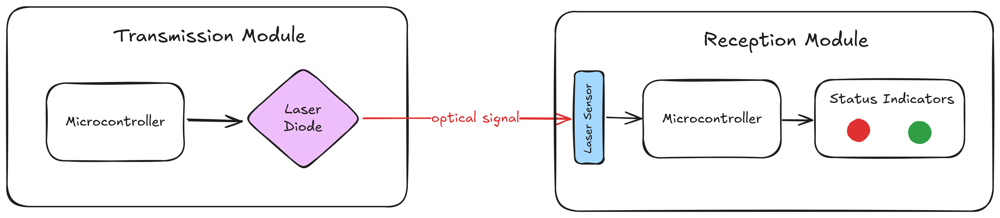
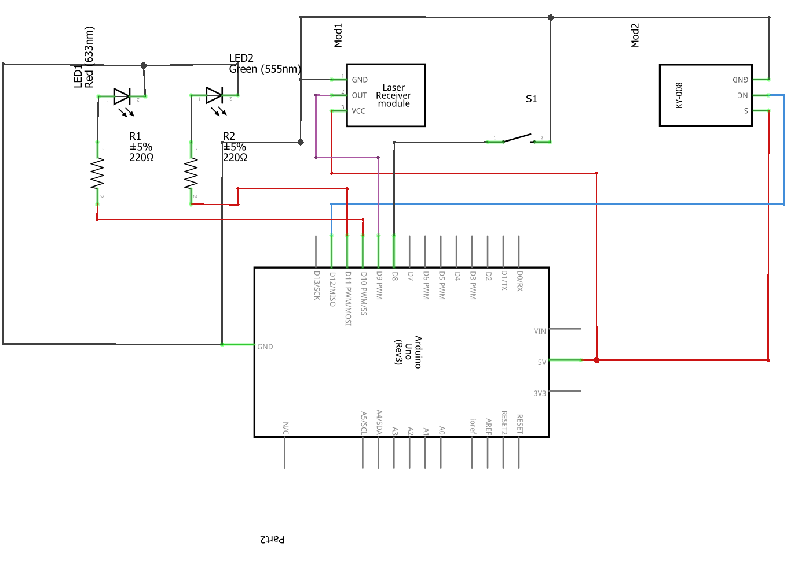
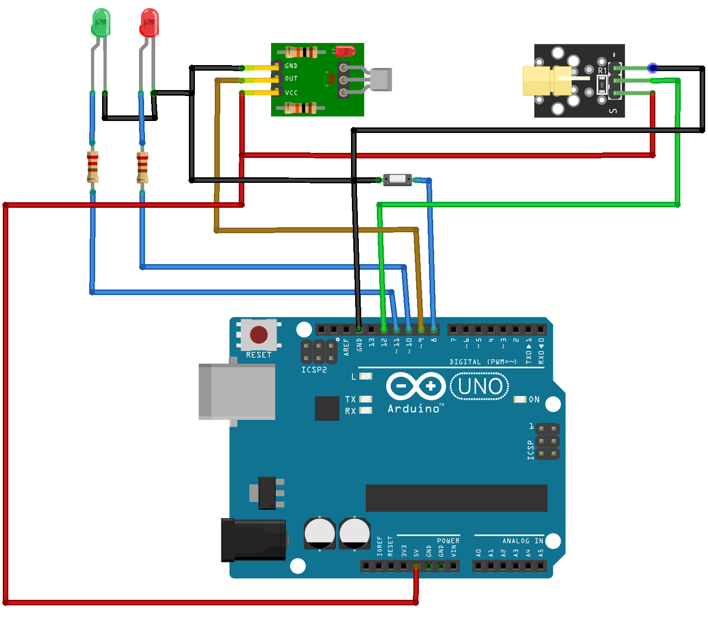

# LaserAuthLock 🔒

Digital Pulse-Coded Laser Authentication System

## Overview
This project implements a contactless digital authentication system utilizing modulated laser pulses for access control applications. The system employs an 8-bit binary sequence transmitted via a 650nm laser diode and detected by a dedicated laser sensor, demonstrating the practical application of optical physics principles in modern security solutions. The implementation achieves reliable authentication while maintaining cost-effectiveness through the use of readily available components.

## Features
- Contactless authentication
- 8-bit binary sequence transmission
- Laser diode modulation
- Laser sensor detection
- Cost-effective design
- Easy integration
- Arduino-compatible

## Hardware
- Arduino Uno
- 650nm Laser Diode
- Laser Sensor Module
- Breadboard
- Jumper Wires
- Resistors (220Ω)
- LEDs (Red, Green)
- Push Button

## Data Transmission Flow
1. The Arduino generates an 8-bit binary sequence.
2. The binary sequence is modulated and transmitted via the laser diode.
3. The laser sensor detects the modulated signal.
4. The detected signal is decoded and compared with the stored sequence.
5. Access is granted or denied based on the comparison result.
6. The system status is indicated by the LEDs.

## Circuit Diagram

# Circuit Connections

## Usage
1. Connect the components as per the circuit diagram.
2. Upload the `LaserLockAuth.ino` sketch to the Arduino Uno.
3. Power the system using a USB cable or external power supply.
4. Use the push button to trigger the authentication process.
5. Observe the LED indicators for the system status.

## License
This project is licensed under the AGPL-3.0 License - see the [LICENSE](LICENSE) file for details.

## Acknowledgements
- [Arduino](https://www.arduino.cc/)
- [Fritzing](https://fritzing.org/)

## Author
- [Arnav Kumar](https://github.com/arnav-kr)